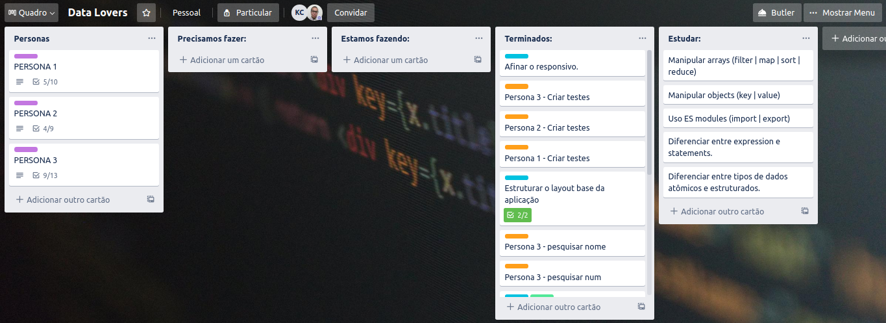
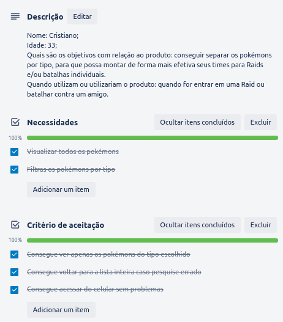
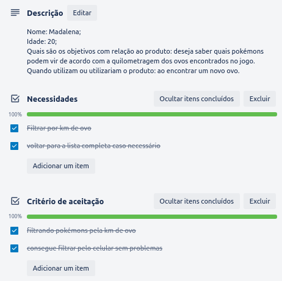

### Índice.

* [1. Definição de produto](#definicaoproduto)
* [2. Protótipos](#prototipos)
* [3. Planejamento](#planejamento)
* [4. Testes de usabilidade](#testesusabilidade)
* [5. Funcionalidades da aplicação](#funcionalidadesaplicacao)

&nbsp;

---

&nbsp;

#### 1. Definição de produto. 

Este projeto foi desenvolvido por [Kathleen Fortunato](https://github.com/Fortunatok) e [Bia Costa](https://github.com/biacostadev) alunas da 5a Geração da [Laboratoria](https://github.com/Laboratoria) (SAP005).

O objetivo desse projeto foi trabalhar com dados (dispostos em forma de array e object) e distribuí-los ao seu devido público como informações através de uma WebApp responsiva para smartphones. 

O tema escolhido foi pokémon e durante as 3 semanas que trabalhamos nesse projeto nós procuramos facilitar a vida dos usuarios, com um layout agradavel aos olhos e opções de filtros que podem deixar muito mais facil a navegação pelo site.

#### 2. Protótipos. 

#### 3. Planejamento. 

> Usamos o Trello para organizar as tarefas e o contéudo a ser estudado.

###### Historias de Usuarios.

Criamos três historias de usuarios baseadas em pesquisas que fizemos e seguindo o perfil de cada um colocamos necessidades e criterios de aceitação.

> Persona 1

---

> Persona 2

---

> Persona 3

#### 4. Testes de usabilidade. 

Durante a desenvolvimento do projeto, criamos um github pages e enviamos para possiveis usuarios, com o intuito de melhorar nosso projeto com os feedbacks recebidos sobre cores e responsividade.

Algumas melhorias que decectamos foi:
* Os filtros precisam ser limpos quando uma nova pesquisa for feita.
* Os cards quebravam em alguns smartphones.
* Os cards não viraram de volta ao serem clicados, precisando o usuário clicar em outro card ou em algum lugar "vazio" da tela.

#### 5. Funcionalidades da aplicação 

A página permite que o usuário faça a busca pelo nome, numero, tipo de pokémon, km e também ordenar a lista por ordem alfabética e números (ambos com ordem crescente e decrescente).

Ao passar o mouse por cima dos cards um flip é acionado mostrando mais informações sobre o pokémon desejado.
